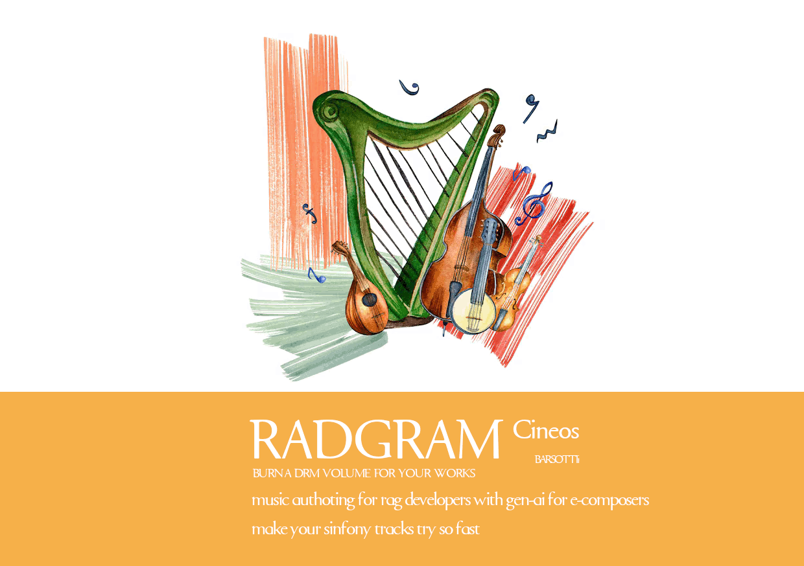

# 🎼 RADGRAM



**RADGRAM** is a Python package for intelligent music composition and authoring using PDF sheet music, scanned images, `.rad` text files, web search data, and AI-driven commands.

> **Create your orchestra now.**  
> Designed for composers, RAG developers, and generative AI engineers.

---

## 🚀 Installation

RADGRAM is available on PyPI:

```bash
#pip install radgram_v1 [obs:underconstruction - please wait for release - have a nice day]
````

---

## ✨ Key Features

* 📄 **Reads sheet music** from PDF files, scanned images, and `.rad` text files
* 🧠 **AI-powered music generation** based on photos, prompts, and commands
* 🎼 **Audio rendering and export** to formats like `.mp3`, `.ogg`, `.wav`, `.flac`, `.mp4`
* 🛠️ **Automatic mastering** module for optimized audio quality
* 🎨 **Cover art generation** using GEN-AI to visually accompany compositions
* 🗃️ **Media and catalog management**, including volume tracking and archiving
* 🌐 **Web-based musical reference search** for creative inspiration
* 🧩 **Integration-ready for RAG pipelines** and generative AI systems
* 🧪 **Part of CineOS Barsotti – Unix-Like @buskplay creative suite**

---

## 🗺️ Roadmap

| Stage                      | Status           | Description                                                |
| -------------------------- | --------------   | ---------------------------------------------------------- |
| PDF Sheet Music Reader     | ✅ Completed    | OCR-based extraction and musical structure interpretation  |
| `.rad` File Support        | ✅ Completed    | Native parsing for RADGRAM text formats                    |
| Audio Export (All Formats) | ⚙️ In Progress  | Support for MP3, OGG, WAV, FLAC, and MP4 formats           |
| Composition from Images    | ✅ Completed    | Generate music inspired by photographs                     |
| Audio Mastering Module     | ⚙️ In Progress  | Auto-EQ, compression, volume leveling, and final mastering |
| GEN-AI Cover Art           | ⚙️ In Progress  | Generate custom artwork for tracks or albums               |
| Media Management System    | ✅ Completed    | Cataloging and metadata tagging tools                      |
| Web/CLI Interface          | 🔜 Planned      | Web-based and CLI-based authoring tools                    |

---

## 📁 Project Structure

```bash
radgram/
├── core/
├── audio/
├── vision/
├── mastering/
├── catalog/
├── artgen/
├── manual/
│   └── readme.md
└── examples/
```

---

## 📘 Command Manual

Full usage guide and examples:
👉 [`./manual/readme.md`](./manual/readme.md)

---

## 📦 Repository

GitHub: [github.com/ssmool/radgram](https://github.com/ssmool/radgram)

---

## 💡 About

RADGRAM is part of the creative tooling suite **CineOS Barsotti – Unix Like @buskplay**, developed by **#asytrick**.
It is tailored for contemporary composers and generative AI developers looking to innovate in musical creativity.

---

## 📬 Contact

Questions, feedback, or contributions?
✉️ [eusmool@gmail.com](mailto:eusmool@gmail.com)

---

> ⚠️ **This project is under active development.**
> Stay tuned for updates and new features in the repository.

```
