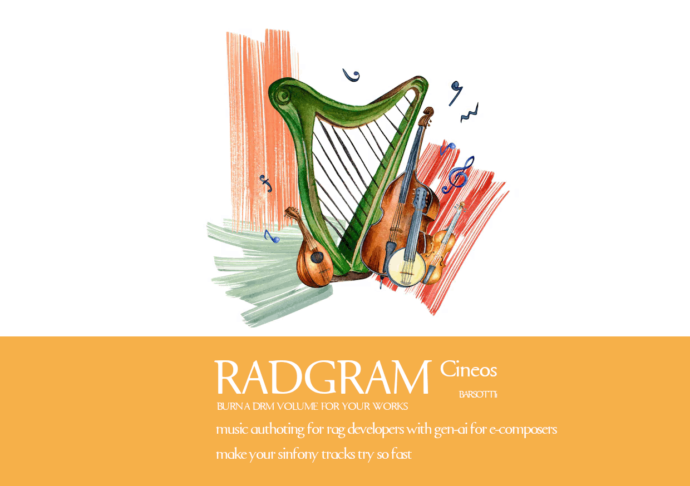

# 🎼 RADGRAM



**RADGRAM** is a Python package for intelligent music composition and authoring using PDF sheet music, scanned images, `.rad` text files, web search data, and AI-driven commands.

> **Create your orchestra now.**  
> Designed for composers, RAG developers, and generative AI engineers.

---

## 🚀 Installation

RADGRAM is available on PyPI:

```bash
#pip install radgram_v1 [obs:underconstruction - please wait for release - have a nice day]
````

---

## ✨ Key Features

* 📄 **Reads sheet music** from PDF files, scanned images, and `.rad` text files
* 🧠 **AI-powered music generation** based on photos, prompts, and commands
* 🎼 **Audio rendering and export** to formats like `.mp3`, `.ogg`, `.wav`, `.flac`, `.mp4`
* 🛠️ **Automatic mastering** module for optimized audio quality
* 🎨 **Cover art generation** using GEN-AI to visually accompany compositions
* 🗃️ **Media and catalog management**, including volume tracking and archiving
* 🌐 **Web-based musical reference search** for creative inspiration
* 🧩 **Integration-ready for RAG pipelines** and generative AI systems
* 🧪 **Part of CineOS Barsotti – Unix-Like @buskplay creative suite**

---

## 🗺️ Roadmap

| Stage                      | Status           | Description                                                |
| -------------------------- | --------------   | ---------------------------------------------------------- |
| PDF Sheet Music Reader     | ✅ Completed    | OCR-based extraction and musical structure interpretation  |
| `.rad` File Support        | ✅ Completed    | Native parsing for RADGRAM text formats                    |
| Audio Export (All Formats) | ⚙️ In Progress  | Support for MP3, OGG, WAV, FLAC, and MP4 formats           |
| Composition from Images    | ✅ Completed    | Generate music inspired by photographs                     |
| Audio Mastering Module     | ⚙️ In Progress  | Auto-EQ, compression, volume leveling, and final mastering |
| GEN-AI Cover Art           | ⚙️ In Progress  | Generate custom artwork for tracks or albums               |
| Media Management System    | ✅ Completed    | Cataloging and metadata tagging tools                      |
| Web/CLI Interface          | 🔜 Planned      | Web-based and CLI-based authoring tools                    |

---

## 📁 Project Structure

```bash
radgram/
├── core/
├── audio/
├── vision/
├── mastering/
├── catalog/
├── artgen/
├── manual/
│   └── readme.md
└── examples/
```

---

## 📘 Command Manual

Full usage guide and examples:
👉 [`./manual/readme.md`](./manual/readme.md)

---

## 📦 Repository

GitHub: [github.com/ssmool/radgram](https://github.com/ssmool/radgram)

---

## 💡 About

RADGRAM is part of the creative tooling suite **CineOS Barsotti – Unix Like @buskplay**, developed by **#asytrick**.
It is tailored for contemporary composers and generative AI developers looking to innovate in musical creativity.

---

## RADGRAM PIPELINE COMMNADS

```bash
python -m radgram.cli --help

python -m radgram.cli version

python -m radgram.cli doctor

python -m radgram.cli shell

python -m radgram.cli logs

python -m radgram.cli clean

python -m radgram.cli optimize

python -m radgram.cli update


# ------------------------------------------------------------------------------
# DATABASE
# ------------------------------------------------------------------------------


python -m radgram.cli init-db

python -m radgram.cli db-status

python -m radgram.cli db-vacuum

python -m radgram.cli db-backup \
    --database radgram.sqlite3 \
    --output backups/radgram_backup.sqlite3

python -m radgram.cli db-restore \
    --database backups/radgram_backup.sqlite3


# ------------------------------------------------------------------------------
# CONFIGURATION
# ------------------------------------------------------------------------------

python -m radgram.cli config-show

python -m radgram.cli config-set \
    --key audio.sample_rate \
    --value 48000

python -m radgram.cli config-reset


# ------------------------------------------------------------------------------
# IMPORT
# ------------------------------------------------------------------------------

python -m radgram.cli import-source \
    --file score.pdf

python -m radgram.cli import-source \
    --file score.png \
    --ocr

python -m radgram.cli import-source \
    --file song.musicxml

python -m radgram.cli import-source \
    --file song.mid

python -m radgram.cli import-source \
    --file composition.rad

python -m radgram.cli import-source \
    --url https://www.cifraclub.com.br/song

python -m radgram.cli import-source \
    --url https://tabs.ultimate-guitar.com/song

python -m radgram.cli import-source \
    --url https://musescore.com/user/song


# ------------------------------------------------------------------------------
# OCR
# ------------------------------------------------------------------------------

python -m radgram.cli ocr \
    --file score.pdf

python -m radgram.cli ocr \
    --file score.png \
    --language eng

python -m radgram.cli ocr \
    --file score.jpg \
    --music


# ------------------------------------------------------------------------------
# VISION
# ------------------------------------------------------------------------------

python -m radgram.cli vision-scan \
    --file score.png

python -m radgram.cli vision-detect \
    --file orchestra.jpg

python -m radgram.cli vision-extract \
    --file score.pdf


# ------------------------------------------------------------------------------
# WEB SEARCH
# ------------------------------------------------------------------------------

python -m radgram.cli web-search \
    --query "Jazz Piano"

python -m radgram.cli web-search \
    --query "Bossa Nova Chords"

python -m radgram.cli web-import \
    --url https://www.songsterr.com/

python -m radgram.cli web-import \
    --url https://www.cifraclub.com.br/


# ------------------------------------------------------------------------------
# AI COMPOSER
# ------------------------------------------------------------------------------

python -m radgram.cli compose \
    --title "Dreams" \
    --artist "RADGRAM AI" \
    --genre Jazz \
    --tempo 120 \
    --key C \
    --progression "C Am F G"

python -m radgram.cli compose-ai \
    --prompt "Epic orchestral soundtrack"

python -m radgram.cli compose-image \
    --image sunset.jpg

python -m radgram.cli compose-style \
    --style BossaNova \
    --duration 180


# ------------------------------------------------------------------------------
# MAESTRO
# ------------------------------------------------------------------------------

python -m radgram.cli maestro-create \
    --title "Studio Project"

python -m radgram.cli maestro-open \
    --project 1

python -m radgram.cli maestro-render \
    --project 1 \
    --output exports/song.wav

python -m radgram.cli maestro-play \
    --project 1

python -m radgram.cli maestro-export \
    --project 1 \
    --format mp3


# ------------------------------------------------------------------------------
# INSTRUMENTS
# ------------------------------------------------------------------------------

python -m radgram.cli add-instrument \
    --name Piano \
    --family Keys

python -m radgram.cli add-instrument \
    --name Guitar \
    --family Strings

python -m radgram.cli edit-instrument \
    --id 1 \
    --volume 85

python -m radgram.cli list-instruments

python -m radgram.cli remove-instrument \
    --id 1


# ------------------------------------------------------------------------------
# SAMPLES
# ------------------------------------------------------------------------------

python -m radgram.cli add-sample \
    --instrument Piano \
    --note C4 \
    --file samples/piano/C4.wav

python -m radgram.cli add-sample \
    --instrument Guitar \
    --chord Am \
    --file samples/guitar/Am.wav

python -m radgram.cli sample-import \
    --directory samples/

python -m radgram.cli list-samples


# ------------------------------------------------------------------------------
# PHONEMES
# ------------------------------------------------------------------------------

python -m radgram.cli add-phoneme \
    --phoneme a \
    --file samples/voice/a.wav

python -m radgram.cli add-phoneme \
    --phoneme sam \
    --file samples/voice/sam.wav

python -m radgram.cli list-phonemes


# ------------------------------------------------------------------------------
# SPEECH
# ------------------------------------------------------------------------------

python -m radgram.cli speak \
    --voice default \
    --text "Welcome to RADGRAM"

python -m radgram.cli sing \
    --voice female \
    --lyrics lyrics.txt \
    --melody song.musicxml


# ------------------------------------------------------------------------------
# AUDIO
# ------------------------------------------------------------------------------

python -m radgram.cli audio-cut \
    --input song.wav \
    --start 15 \
    --duration 20 \
    --output cut.wav

python -m radgram.cli audio-trim \
    --input song.wav \
    --output trim.wav

python -m radgram.cli audio-merge \
    --input intro.wav chorus.wav solo.wav \
    --output full.wav

python -m radgram.cli audio-normalize \
    --input song.wav

python -m radgram.cli audio-fade \
    --input song.wav \
    --fade-in 2 \
    --fade-out 5

python -m radgram.cli audio-pitch \
    --input vocal.wav \
    --semitones 2

python -m radgram.cli audio-speed \
    --input song.wav \
    --speed 1.25


# ------------------------------------------------------------------------------
# MASTERING
# ------------------------------------------------------------------------------

python -m radgram.cli master \
    --input mix.wav \
    --output master.wav

python -m radgram.cli master \
    --input mix.wav \
    --target-lufs -14

python -m radgram.cli master-eq \
    --input mix.wav

python -m radgram.cli master-limit \
    --input mix.wav


# ------------------------------------------------------------------------------
# EXPORT
# ------------------------------------------------------------------------------

python -m radgram.cli export-wav \
    --track 1 \
    --output song.wav

python -m radgram.cli export-mp3 \
    --track 1 \
    --bitrate 320

python -m radgram.cli export-flac \
    --track 1

python -m radgram.cli export-ogg \
    --track 1

python -m radgram.cli export-midi \
    --track 1

python -m radgram.cli export-musicxml \
    --track 1


# ------------------------------------------------------------------------------
# ARTISTS
# ------------------------------------------------------------------------------

python -m radgram.cli add-artist \
    --name "RADGRAM AI"

python -m radgram.cli list-artists

python -m radgram.cli show-artist \
    --id 1


# ------------------------------------------------------------------------------
# TRACKS
# ------------------------------------------------------------------------------

python -m radgram.cli create-track \
    --title "Opening"

python -m radgram.cli list-tracks

python -m radgram.cli edit-track \
    --id 1 \
    --title "Opening Theme"

python -m radgram.cli remove-track \
    --id 1


# ------------------------------------------------------------------------------
# ALBUMS
# ------------------------------------------------------------------------------

python -m radgram.cli create-album \
    --artist 1 \
    --title "Digital Dreams"

python -m radgram.cli album-add-track \
    --album 1 \
    --track 2

python -m radgram.cli album-from-tracks \
    --title "Best Of" \
    --tracks 1 2 3 4

python -m radgram.cli album-from-sheets \
    --title "OCR Album" \
    --files score1.pdf score2.pdf score3.pdf

python -m radgram.cli list-albums


# ------------------------------------------------------------------------------
# LIBRARY
# ------------------------------------------------------------------------------

python -m radgram.cli library-list

python -m radgram.cli library-search \
    --query Piano

python -m radgram.cli library-export \
    --output library.json


# ------------------------------------------------------------------------------
# STREAMING
# ------------------------------------------------------------------------------

python -m radgram.cli stream-add \
    --track 1 \
    --mode blob

python -m radgram.cli stream-add \
    --track 1 \
    --mode base64

python -m radgram.cli stream-track \
    --track 1

python -m radgram.cli stream-album \
    --album 2


# ------------------------------------------------------------------------------
# JAM
# ------------------------------------------------------------------------------

python -m radgram.cli create-jam \
    --title "Friday Night"

python -m radgram.cli join-jam \
    --jam 1

python -m radgram.cli jam-add-track \
    --jam 1 \
    --track 5

python -m radgram.cli jam-render \
    --jam 1


# ------------------------------------------------------------------------------
# COVER AI
# ------------------------------------------------------------------------------

python -m radgram.cli cover-generate \
    --album 1 \
    --prompt "Cyberpunk Jazz"

python -m radgram.cli cover-generate \
    --track 2 \
    --image cover.png


# ------------------------------------------------------------------------------
# WEBSITE
# ------------------------------------------------------------------------------

python -m radgram.cli website-create \
    --album 1

python -m radgram.cli website-build \
    --album 1

python -m radgram.cli website-publish \
    --album 1 \
    --host localhost


# ------------------------------------------------------------------------------
# RADDISK
# ------------------------------------------------------------------------------

python -m radgram.cli export-raddisk \
    --album 1 \
    --output album.raddisk

python -m radgram.cli import-raddisk \
    --file album.raddisk

python -m radgram.cli inspect-raddisk \
    --file album.raddisk

python -m radgram.cli verify-raddisk \
    --file album.raddisk


# ------------------------------------------------------------------------------
# DRM
# ------------------------------------------------------------------------------

python -m radgram.cli drm-encrypt \
    --album 1

python -m radgram.cli drm-sign \
    --album 1

python -m radgram.cli drm-verify \
    --album 1


# ------------------------------------------------------------------------------
# RAG
# ------------------------------------------------------------------------------

python -m radgram.cli rag-index \
    --folder library/

python -m radgram.cli rag-search \
    --query "Jazz Piano"

python -m radgram.cli rag-rebuild


# ------------------------------------------------------------------------------
# PLUGINS
# ------------------------------------------------------------------------------

python -m radgram.cli plugin-install \
    plugins/piano.radplugin

python -m radgram.cli plugin-enable Piano

python -m radgram.cli plugin-list

python -m radgram.cli plugin-disable Piano


# ------------------------------------------------------------------------------
# API
# ------------------------------------------------------------------------------

python -m radgram.cli api-start

python -m radgram.cli api-status

python -m radgram.cli api-stop


# ------------------------------------------------------------------------------
# WEB STUDIO
# ------------------------------------------------------------------------------

python -m radgram.cli serve

python -m radgram.cli serve \
    --host 0.0.0.0 \
    --port 8000

python -m radgram.cli serve-web

python -m radgram.cli serve-stream

python -m radgram.cli serve-api
```

## 📬 Contact

Questions, feedback, or contributions?
✉️ [eusmool@gmail.com](mailto:eusmool@gmail.com)

---

> ⚠️ **This project is under active development.**
> Stay tuned for updates and new features in the repository.

```
